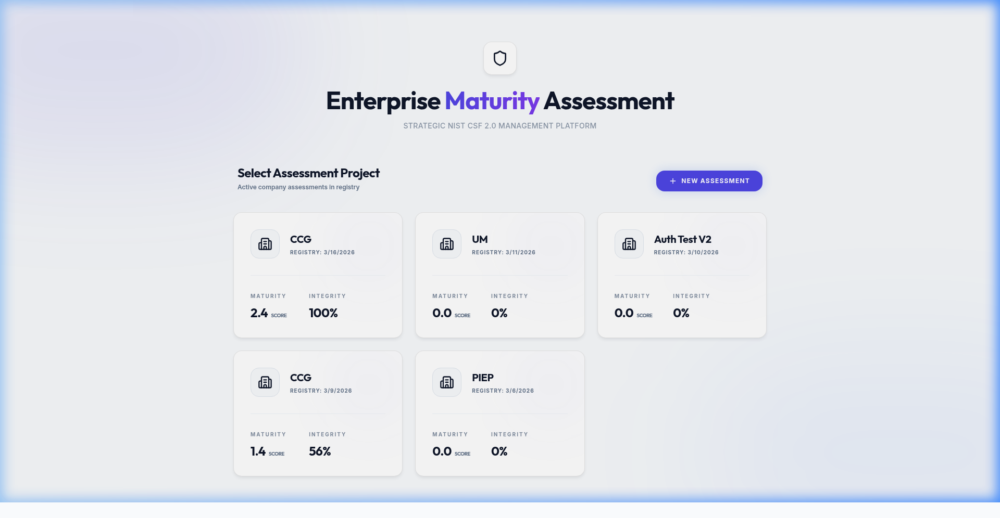
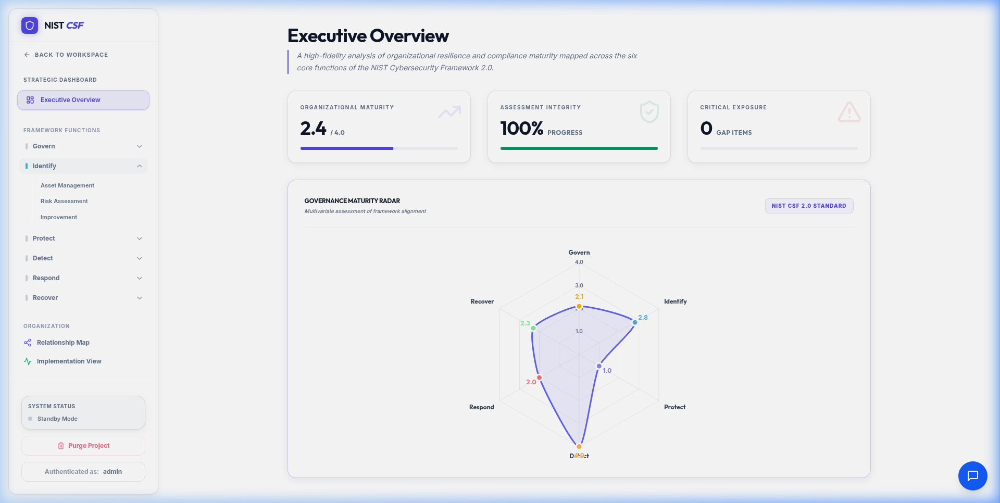
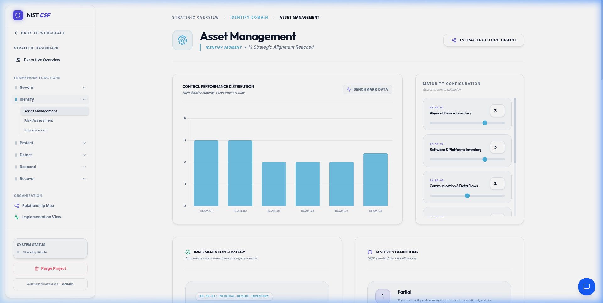
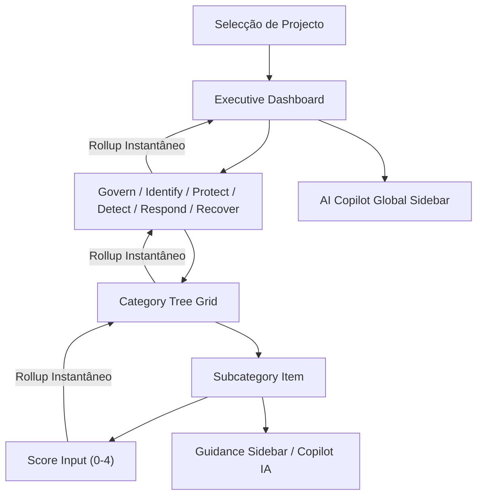

# 🛡️ Enterprise Maturity Assessment (NIST CSF 2.0)

Plataforma de auditoria e gestão de maturidade de segurança da informação, desenvolvida para mapear riscos e conformidade contra o framework **NIST CSF 2.0**.

---

## 📖 Índice

1.  [🖼️ Visualização do Painel](#️-visualização-do-painel)
2.  [🚀 Funcionalidades Principais](#-funcionalidades-principais)
3.  [🧩 Arquitetura do Sistema](#-arquitetura-do-sistema)
4.  [Plug-ins e RAG Analyzer](#plug-ins-e-rag-analyzer)
5.  [🔌 APIs e Endpoints](#-apis-e-endpoints)
6.  [⚙️ Configuração (`.env`)](#️-configuração-env)
7.  [📂 Persistência de Dados](#-persistência-de-dados)
8.  [🛡️ Segurança de Rede](#️-segurança-de-rede)
9.  [🛠️ Stack Tecnológico](#️-stack-tecnológico)
10. [🏃‍♂️ Como Executar](#️-como-executar)

---

## 🖼️ Visualização do Painel

### 🔘 1. Seleção de Baseline / Projectos

*Ecrã de entrada para seleccionar ou inicializar novas balizas de auditoria organizacionais.*

### 📊 2. Sumário Executivo (Maturidade)

*Painel de alto nível demonstrando pontuação combinada (Maturity aggregates) divididos nas 6 macro-funções.*

### 📋 3. Grelha de Categorias (Detalhamento)

*Vista expandida de uma Categoria (ex: Asset Management) demonstrando a tabela com requisitos, scores (0-4), e notas de auditoria do utilizador.*

---

## 🚀 Funcionalidades Principais

*   **Dashboards Inteligentes (Drill-Down)**:
    *   `Overview`: Vista executiva com radar-charts e agregados globais.
    *   `Function View`: Detalhe por grupo de categorias com sub-cards rápidos.
    *   `Category Grid`: Formulário granular para responder a requisitos de auditoria.
*   **Copilot de IA Sidebar (NIST MCP Setup)**: Assistente lateral persistente (400px) com contexto sincronizado ao estado de cada regra. O backend utiliza um servidor MCP (Model Context Protocol) para invocar queries técnicas de segurança dinamicamente via LLM (Ollama).
*   **Guidance Assistance lateral**: Cada subcategoria (ex: `PR.AA-01`) abre um painel descrevendo as melhores práticas e requisitos para que o auditor saiba o que avaliar.
*   **Rollup Automático de Scores**: Mecanismo que propaga pontuações instantaneamente de `Subcategoria -> Categoria -> Função -> Overall Score`.
*   **Gestão de Sessão & Controle de Acesso**: Bloqueios de CSRF, session blacklist e rate limiting de tentativas de brute force.

---

## 🧩 Arquitetura do Sistema

O sistema opera com um fluxo de dados consolidado entre a interface e o auditor:



---

## 🔌 APIs e Endpoints (FastAPI)

O backend oferece múltiplos módulos para operações:

| Módulo | Endpoint | Descrição |
| :--- | :--- | :--- |
| **Autenticação** | `/api/token` | Geração de tokens JWT seguros. |
|  | `/api/auth/me` | Recuperar perfil do utilizador actual. |
| **Projectos** | `/api/projects` | `GET/POST` Listar e criar novas auditorias organizacionais. |
|  | `/api/projects/{id}` | `GET/POST/DELETE` Gravar e obter estado da árvore NIST. |
| **AI (RAG/MCP)** | `/api/nist/tools` | Lista de ferramentas injectadas no LLM. |
|  | `/api/nist/chat` | Ponto de entrada p/ diálogo com o assistente Copilot. |
| **Ollama** | `/api/ollama/status` | Verificar se o motor de LLM está online. |

---

## ⚙️ Configuração (`.env`)

O projeto utiliza um ficheiro `.env` na raíz para gerir credenciais e chaves de segurança críticas:

| Variável | Valor Exemplo / Default | Descrição |
| :--- | :--- | :--- |
| **`ADMIN_PASSWORD`** | `Admin_Nist_2026_Secure` | Palavra-passe do administrador para o painel. |
| **`SECRET_KEY`** | `Chave_Super_Secreta_Aqui` | Chave de assinatura para tokens JWT. |
| **`ALGORITHM`** | `HS256` | Algoritmo de Hashing para a cifra. |
| **`ACCESS_TOKEN_EXPIRE_MINUTES`** | `60` | Tempo de expiração da sessão ativa. |

---

## 📂 Persistência de Dados

O backend grava o estado de cada projeto de auditoria numa estrutura de ficheiros leve (Flat-file DB) para máxima velocidade e portabilidade:

*   **Directoria**: `backend/data/projects/`
*   **Formato de Ficheiro**: `{uuid-do-projeto}.json`
*   **Acesso e Segurança**: Apenas o utilizador criador (`owner`) com token JWT válido pode ler ou apagar o ficheiro via middleware FastAPI.

---

## 🛡️ Medidas de Segurança de Rede

*   **Rate Limiting**: Bloqueio de 10 tentativas de login por minuto em `/api/token` prevenindo Brute Force.
*   **Session Revocation**: As sessões podem ser expiradas instantaneamente (Blacklist list activa em RAM) evitando exploração de tokens roubados.
*   **CORS**: Limitado estritamente aos hosts de desenvolvimento (`http://localhost:3001` e `:3002`).

---

## 🛠️ Stack Tecnológico

*   **Frontend**: React 19 + Vite 8
*   **Estilos**: TailwindCSS v4 (Glassmorphism limpo, micro-animações, clean shadows).
*   **Interface State**: React Context API (`AssessmentContext.jsx`) para cálculos rápidos em client-side.
*   **Backend**: Python FastAPI compatibility framework, OAuth2 com JWT cookies.

---

## 🏃‍♂️ Como Executar (Localmente)

Para subir o painel e o backend em simultâneo:

```bash
chmod +x start.sh
./start.sh
```

*(O painel estará disponível em `http://localhost:3001` e `localhost:3002`)*
